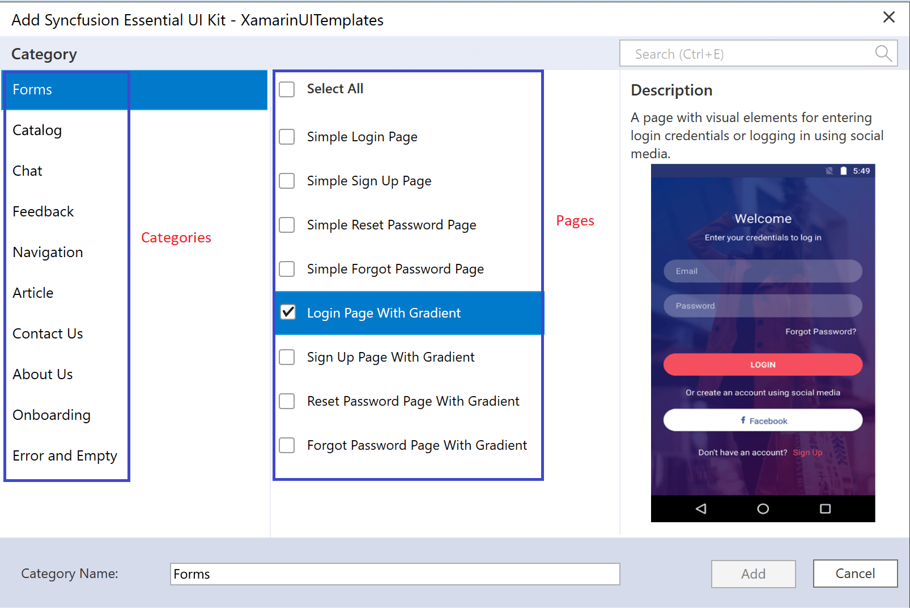
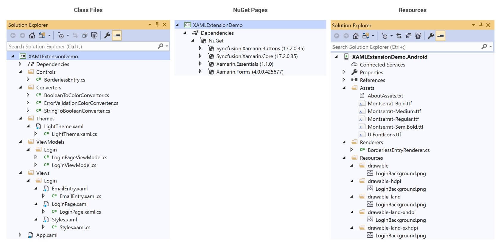

# Syncfusion XAML Templates for Xamarin.Forms

The Syncfusion Essential UI Kit is a collection of easy-to-use, extendable, and adaptable XAML templates that allows you to quickly create a Xamarin.Forms application by providing generic pre-defined screens. Now, the UI Kit has screens for the following categories:

* Login
* ECommerce
* Chat
* Feedback
* Contact Us
* About Us
* Article
* Navigation
* Error and Empty

The screens are developed with MVVM pattern, which separates the UI and business logic results in a clean, professional, and scalable representation of user interface in your Xamarin.Forms applications. You can get the UI Kit application from [Google Play Store] (https://play.google.com/store/apps/details?id=com.syncfusion.xamarin.uikit) and the complete source code is available in [GitHub repository](https://github.com/syncfusion/essential-ui-kit-for-xamarin.forms)

# Supported Platforms

* Android 5.0 (or API level 21) and later versions.
* iOS 9.0 and later versions.
* UWP Build 17763 and later versions

The required minimum version of Xamarin.Forms is 4.0.0.425677.

## Adding predefined screens to your application

The screens can be added in your application by the following two ways: 

1. Using **XAML UI Kit for Xamarin.Forms** Visual Studio extension.

2. Copying the files from our open source [GitHub repository](https://github.com/syncfusion/essential-ui-kit-for-xamarin.forms).

## Essential UI Kit for Xamarin.Forms Extension

This is the easiest way to add the pre-defined screens to your application. The following steps explain how to add screens to an application with our extension: 

1. Open Visual Studio.

2. Go to Extension, and then click Manage Extensions as shown in the following screenshot.

   

3. Search for **XAML UI Kit for Xamarin.Forms**, and then install it.

   

4. Restart the Visual Studio and allow it to complete the installation. 

5. Now, open an existing Xamarin.Forms application or create a new application as per your requirements.
 
6. Right-click the Xamarin.Forms [NETStandard] project, and you can see the **XAML UI Kit for Xamarin.Forms** option.

7. Select the category and pages you need to add in your application. In the following screenshot, the **Login Page with Gradient** screen has been selected from the **Login** category. 

   

8. Clicking the 'Add' button will include the selected template to your project. The necessary class files, resources, and NuGet package references will automatically be added to your project as shown in the following screenshot.

   

## How to render the added page

In a Xamarin.Forms demo application, you must make the added template as the start-up page in the App.xaml.cs file. 
Example: If you added the Login Page, then you must invoke the page as demonstrated in the following code.


MainPage = new SampleFormsApplication.Views.Login.LoginPage();
 

In real-world applications, you may need to do the following to use these templates:
1. Update the services for fetching the data from remote server or local database.
2. Wire up the navigation and update the business logics in view models.

## Requesting Screens and Reporting Bugs

If you would like to request a new screen or report a bug in existing screens, create a feature request or submit a bug through our [feedback portal](https://www.syncfusion.com/feedback/xamarin-forms?control=ui-kit)

N> Now, **XAML UI Kit for Xamarin.Forms** Visual Studio extension is supported in the Windows operating system only.