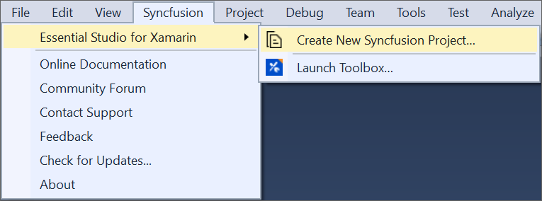
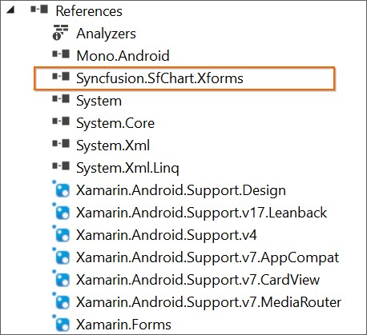
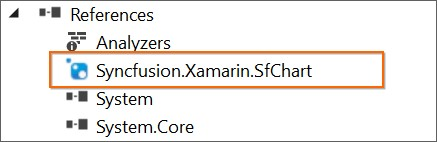
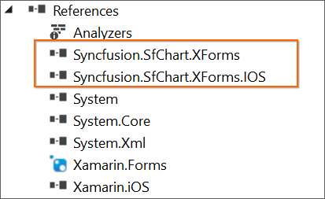

# Creating Syncfusion® Xamarin Application

Syncfusion® provides Visual Studio Project Templates for the Syncfusion® Xamarin platform, allowing you to quickly develop a Syncfusion® Xamarin application by just adding the needed Syncfusion® NuGet packages for the control you want to use. 

I> The Syncfusion® Xamarin Project Templates are available from v16.2.0.41.

To create the **Syncfusion® Xamarin Application** in Visual Studio, follow these steps

> Check whether the **Xamarin Extensions - Syncfusion®** are installed or not in Visual Studio Extension Manager by going to **Extensions -> Manage Extensions -> Installed** for Visual Studio 2019 or later, and for Visual Studio 2017 or lower by going to **Tools -> Extensions and Updates -> Installed**. If this extension not installed, please install the extension by follow the steps from the [download and installation](download-and-installation) help topic.

1.	Follow one of the instructions below to create a Syncfusion® Xamarin project

	**Option 1:**  
	Click **Extensions->Syncfusion®** Menu and choose **Essential Studio® for Xamarin > Create New Syncfusion® Project…** in **Visual Studio**.

	

	N> In Visual Studio 2017 or lower, you can see the Syncfusion® menu directly in the Visual Studio menu.

	

	**Option 2:**  
	Choose **File -> New -> Project**. Opens a new dialog to create a new project. By filtering the project type with Syncfusion® or using the Syncfusion® keyword in the search option, you can get the templates offered by Syncfusion® for Xamarin.

	

	In Visual Studio 2017 or lower, choose **File > New > Project** and navigate to **Syncfusion > Cross-Platform > Syncfusion® Xamarin Project Template** in **Visual Studio**.

	

2.	Click **OK** once you've given the **project  name**, selected a destination location, and set the project's Framework. The Project Configuration Wizard is now displayed.
   
3.	Choose the Project, Android, iOS, and UWP by on/off in the following Project Configuration window to configure the Syncfusion® Xamarin Application.

    

	**Project Configuration:**

	**Assemblies From:** Choose NuGet or Installed Location to load the Syncfusion® Xamarin reference into Xamarin Application.

	N> Installed location option will be shown only when the Syncfusion® Xamarin setup has been installed.

	**Android**

	1. **Minimum Android Version:** Choose the earliest Android version for which you want to provide support for your app. 
	2. **Target Android Version:** Choose the Android version on which your app will run. 

	**iOS**

	1. **Target Device:**  Choose the Xamarin.iOS device of Xamarin.iOS project either Unified, iPhone/iPod, or iPad.
	2. **Target Version:** Select the Xamarin.iOS Project version.

	**Choose controls:** To create the Syncfusion® Xamarin application, choose at least one Syncfusion® control. 

	N> If you want to add other Syncfusion® Xamarin controls in the created Syncfusion® Xamarin application, you can use our [Syncfusion Xamarin toolbox](https://help.syncfusion.com/xamarin/visual-studio-integration/toolbox-control)

	

4.	The Syncfusion® Xamarin Application has been created when you click **Create**.

	N> Choose any one of the project type and controls from Project Configuration Wizard.

	

5.	Based on the control selected, required Syncfusion® NuGet/Assemblies and configuration have been added to the project.

	**Net Standard /PCL**

	

	

	**Android**

	

	

	**iOS**

	

	

	**UWP**

	

	

6.	Then, Syncfusion® licensing registration required message box will be shown if you installed the trial setup or NuGet packages since Syncfusion® introduced the licensing system from 2018 Volume 2 (v16.2.0.41) Essential Studio® release. Navigate to the [help topic](https://help.syncfusion.com/common/essential-studio/licensing/overview#how-to-generate-syncfusion-license-key), which is shown in the licensing message box to generate and register the Syncfusion® license key to your project. Refer to this [blog](https://www.syncfusion.com/blogs/post/whats-new-in-2018-volume-2.aspx) post for understanding the licensing changes introduced in Essential Studio®.

	

