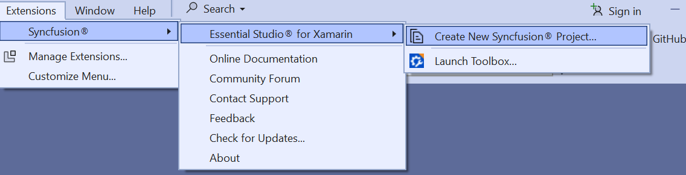

# Xamarin Syncfusion® Extensions Overview

The Syncfusion® Xamarin Visual Studio extensions allow you to create a Xamarin application with Syncfusion® components along with required NuGet packages in Visual Studio.

N> Syncfusion® Extension is published in Visual Studio Marketplace. You can download Xamarin Extensions [here](https://marketplace.visualstudio.com/items?itemName=SyncfusionInc.XamarinExtension).

I> The Syncfusion® Xamarin  menu option is available from v17.1.0.32.

The Syncfusion® provides the following extension supports in Visual Studio:

1.	[Create Project](create-project): To create a Syncfusion® Xamarin application by adding the required Syncfusion® NuGet based on the control chosen.
2.	[Essential® UI Kit](essential-ui-kit): Add the predefined Syncfusion® Xamarin templates in Xamarin.Form and install the required Syncfusion® NuGet packages.
3.	[Toolbox](toolbox-control): Add the Syncfusion® Xamarin components in Xamarin.Forms designer from Syncfusion® Toolbox.

**Essential Studio® for Xamarin in Visual Studio**

N> In Visual Studio 2017 or lower, you can see the Syncfusion® menu directly in the Visual Studio menu.

