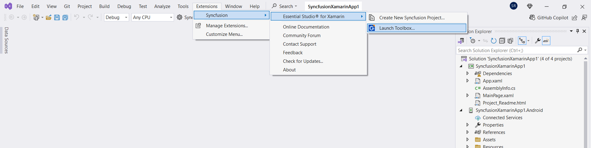
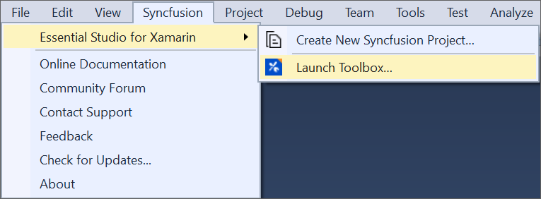
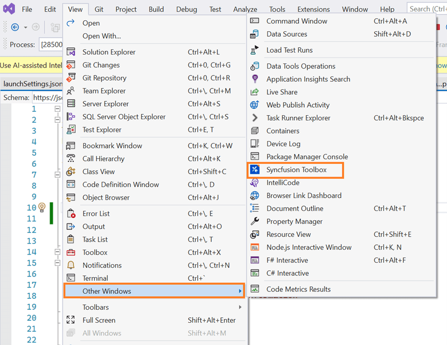
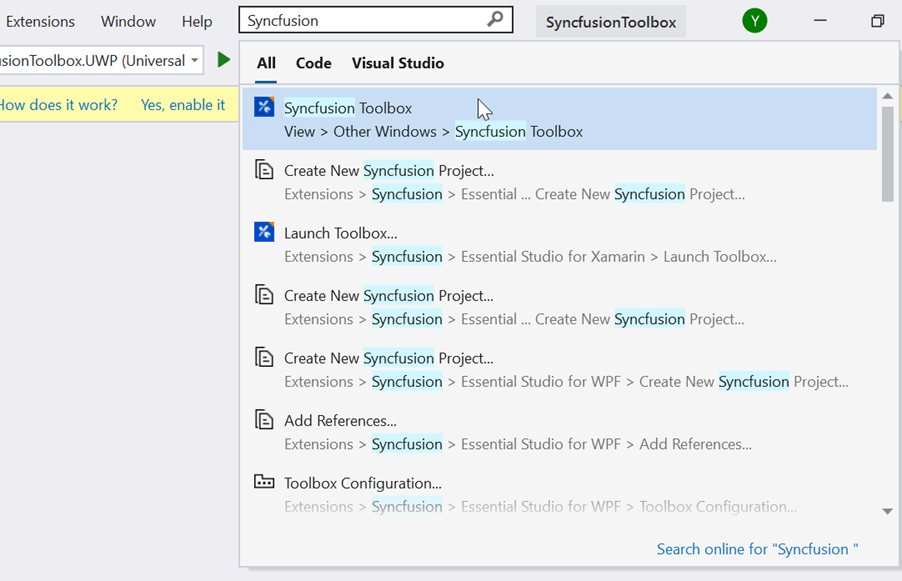
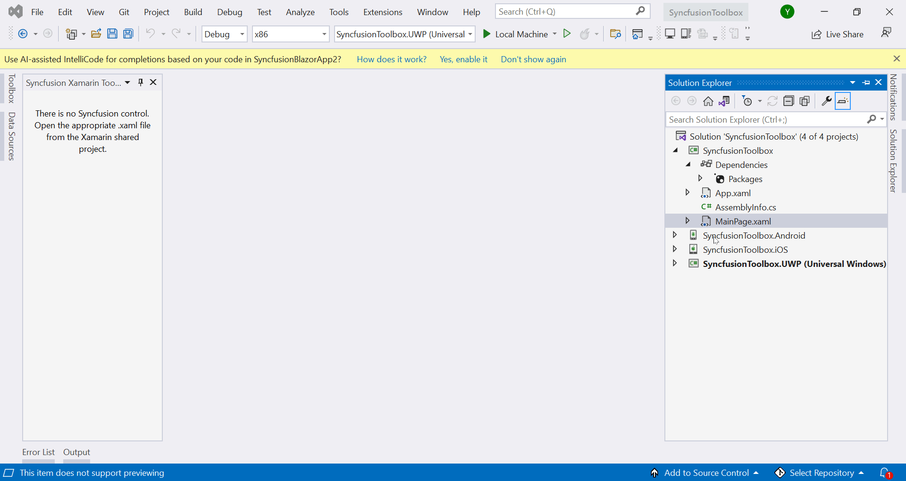

# Syncfusion® Xamarin Toolbox

Syncfusion® provides a Syncfusion® Visual Studio Toolbox for the Xamarin platform to include the Syncfusion® Xamarin (Xamarin.Forms) components in Xamarin applications. It supports Visual Studio 2017. The Syncfusion® Xamarin toolbox allows you to add a Syncfusion® Xamarin component code to the application effortlessly at the appropriate place in the XAML design file. 

I> The Syncfusion® Xamarin Toolbox is available from Essential Studio® 2018 Volume 2(v16.2.0.41).

> Check whether the **Xamarin Extensions - Syncfusion®** are installed or not in Visual Studio Extension Manager by navigating to **Tools -> Extensions and Updates -> Installed** for Visual Studio 2017, and **Extensions -> Manage Extensions -> Installed** for Visual Studio 2019 by navigating to **Extensions -> Manage Extensions -> Installed**. If this extension not installed, please install the extension by follow the steps from the [download and installation](download-and-installation) help topic.

## Launching Syncfusion® Xamarin Toolbox from Syncfusion® menu

**Visual Studio 2019 and later**

To launch the Syncfusion® Toolbox from Visual Studio 2019 and later, click **Extensions** in Visual Studio menu and choose **Syncfusion® > Essential Studio® for Xamarin > Launch Toolbox…**

   

**Visual Studio 2017**

To launch the Syncfusion® Toolbox from Visual Studio 2017, click **Syncfusion®** in Visual Studio menu and choose **Essential Studio® for Xamarin > Launch Toolbox...**

   

## Launching Syncfusion® Xamarin Toolbox from View menu

To launch the Visual Studio Toolbox from Visual Studio menu in Visual Studio 2017 and later, click **View > Other Windows > Syncfusion® Toolbox** in Visual Studio.

   

> You can also find the Syncfusion® Toolbox option  by typing "Syncfusion® Toolbox" into the Quick Launch search field (top right corner in Visual Studio).

   

## Render Syncfusion® components 
   
1.	When you click the Syncfusion® Toolbox window, the Syncfusion® Toolbox wizard is launched, and Syncfusion® components are enabled once you access your application's designer page (XAML). Syncfusion® components will not appear until you open the appropriate design (XAML) file from the Xamarin shared/.NET Standard/PCL project. The rendering of the Syncfusion® Xamarin components is made as simple as possible. All you need to do is simply drag and drop the Syncfusion® Xamarin component from the Syncfusion® toolbox into the designer. The selected component's code snippet and namespace will be added to the designere (XAML), and  the required Syncfusion® Xamarin NuGet packages will be installed.

      

2. Then, Syncfusion® licensing registration required message box will be shown if you installed the trial setup or NuGet packages since Syncfusion® introduced the licensing system from 2018 Volume 2 (v16.2.0.41) Essential Studio® release. Navigate to the [help topic](https://help.syncfusion.com/common/essential-studio/licensing/overview#how-to-generate-syncfusion-license-key), which is shown in the licensing message box, to generate and register the Syncfusion® license key to your project. Refer to this [blog](https://www.syncfusion.com/blogs/post/whats-new-in-2018-volume-2.aspx) post for understanding the licensing changes introduced in Essential Studio®.