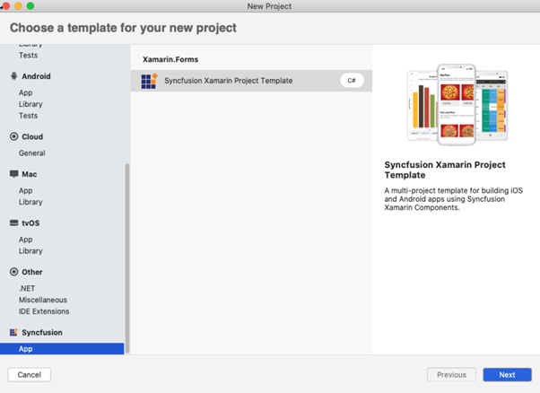
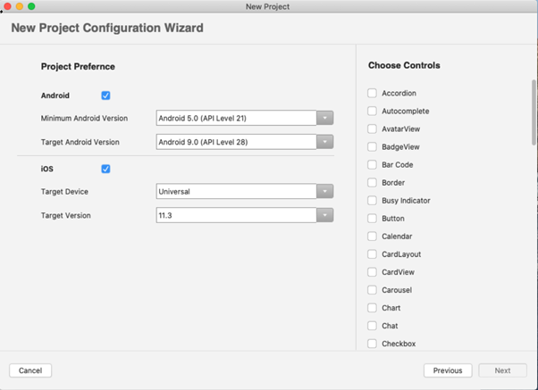

# Create Project

Syncfusion provides the Visual Studio for Mac Project Templates for Xamarin platform to create the Syncfusion Xamarin application with required Syncfusion NuGet packages based on the control chosen.

The following steps illustrates you how to create the Syncfusion Xamarin Application through the Visual Studio 2019 for Mac:

1.	In Visual Studio for Mac, choose one of the options below to create a Syncfusion Xamarin project.

Option 1:
Click **Syncfusion Menu** and choose **Essential Studio for Xamarin > Create New Syncfusion Project**.

Option 2:
Choose **File > New > Project** and navigate to **Syncfusion > App > Syncfusion Xamarin Project Template**.

2.	Choose the options to configure the Syncfusion Xamarin Application by using the following Project Configuration dialog and choose the Project, Android, and iOS by toggling respective checkboxes.

## Android:

**1. Minimum Android Version:** Choose the earliest Android version for which you want to provide support for your app.

**2. Target Android Version:** Choose the Android version on which your app will run.

## iOS:

**1. Target Device:** Choose the Xamarin.iOS device of Xamarin.iOS project either Unified, iPhone/iPod, or iPad.

**2. Target Version:** Select the Xamarin.iOS Project version.  

## Choose controls:

To create the Syncfusion Xamarin application, choose at least one Syncfusion control.

3.  Provide the name of the project and click create.

4.  Required Syncfusion NuGet and configuration have been added to the project based on the Syncfusion component chosen.

**Net Standard:**

**Android:**

**iOS:**

Now, you can follow the [user guide documentation](https://help.syncfusion.com/xamarin/introduction/overview) to use the Syncfusion Xamarin components.
