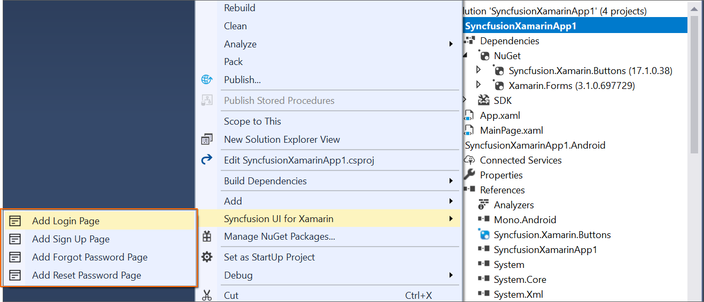

# Item Template

The Syncfusion item templates extension provides a predefined design for the Xamarin.Forms. 

N> Syncfusion Xamarin item template is available from v17.1.0.32.

Use the following steps to add the Syncfusion Xamarin item in Visual Studio:

1. Open a new or existing **Xamarin** application.
 
2. Select the **Xamarin.Forms** project. Add required items by either one of the options below:

   **Option1:**  Click **Syncfusion Menu** and choose **Essential Studio for Xamarin > Add Login Page…** or any other Form in **Visual Studio**.

   

   N> In Visual Studio 2019, Syncfusion menu is available under Extensions in Visual Studio menu.

   **Option2:** Right-click the **Xamarin.Form** project from the **Solution Explorer** and select the **Syncfusion UI for Xamarin** option.

   

   **Option3:** Right-click the **Xamarin.Form** project from the **Solution Explorer**. Open the **Add New Item Dialog box** by select **Add > New Item**.
 
   

   

3. Now, click **ADD**. The selected template is added to the project along with **Syncfusion NuGet package references**.

   

   

   

Render Syncfusion item page after performed add new item by adding the selected template page as startup page in this application. Open the **App.xaml.cs** and make the following changes.

MainPage=new application name.Views. 
**Item name**.selected template page name();

Example: If you added Login Page,

MainPage=new App1.Views.Login1.LoginPage();

4. If you installed the trial setup or NuGet packages from nuget.org you have to register the Syncfusion license key to your project since Syncfusion introduced the licensing system from 2018 Volume 2 (v16.2.0.41) Essential Studio release. Navigate to the [help topic](https://help.syncfusion.com/common/essential-studio/licensing/license-key#how-to-generate-syncfusion-license-key) to generate and register the Syncfusion license key to your project. Refer to this [blog](https://blog.syncfusion.com/post/Whats-New-in-2018-Volume-2-Licensing-Changes-in-the-1620x-Version-of-Essential-Studio.aspx?_ga=2.11237684.1233358434.1587355730-230058891.1567654773) post for understanding the licensing changes introduced in Essential Studio.