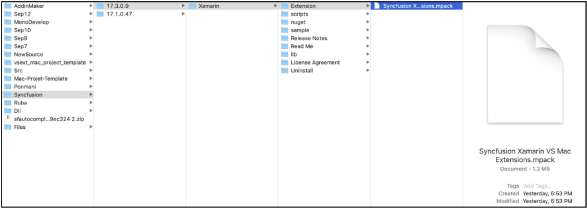
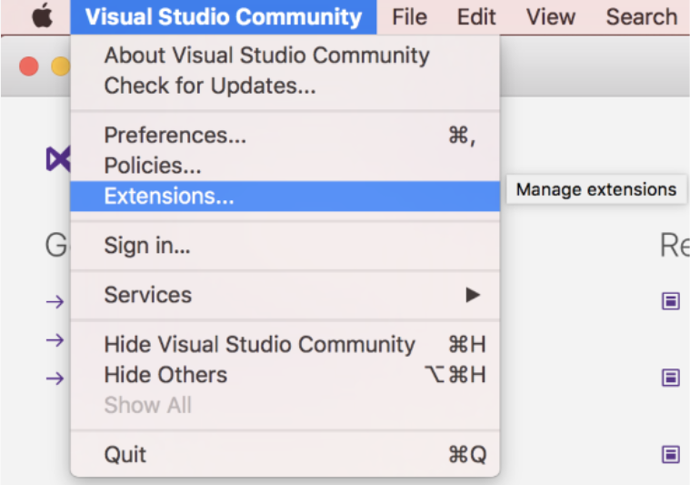
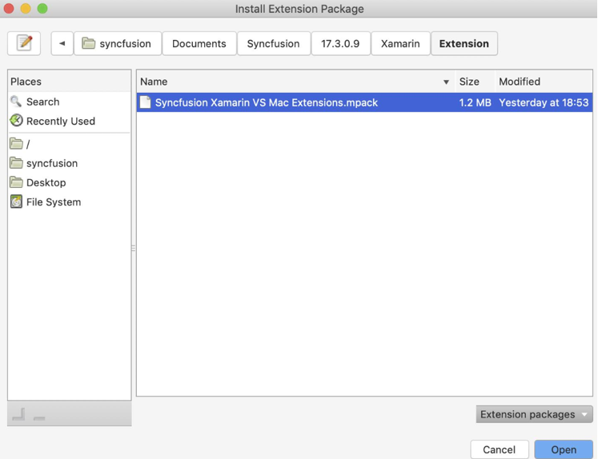

#### Installation

The following procedure illustrates how to install Syncfusion Xamarin Extension in Visual Studio for Mac. 

Follow [this guideline](https://help.syncfusion.com/common/essential-studio/installation/essential-studio-mac-installer) to install the Essential Studio for Xamarin Mac build if not installed, then you will get the Visual Studio for Mac Extensions in installed location.

**Location:**

 Eg: {Documents}\Syncfusion\ {version}\Xamarin\Extension\Syncfusion Xamarin VS Mac Extensions.mpack

2. Open the Visual Studio 2019 for Mac.

3. Click the Visual Studio Community/Professional/Enterprise and select the Extensions…

    

4. The Extension Manager window will open. Select the Install from file… 

    

5. The Install Extension Package dialog will open. Navigate to Syncfusion Xamarin Mac Extensions file(.mpack) location which explained in above and click open to install.

    

6. Once the extension installed, the Syncfusion Xamarin Extension will listed in the IDE extension section.

    