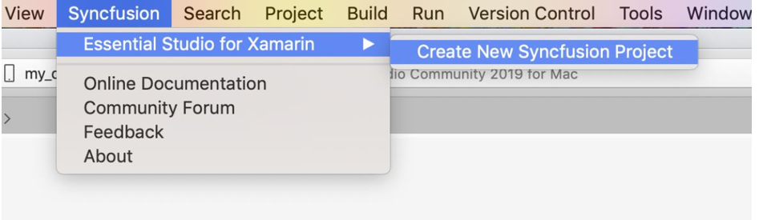

#### Overview

The Syncfusion Essential Studio for Xamarin Visual Studio for Mac extensions that allow you to create the Xamarin application in Visual Studio for Mac with the Syncfusion components. 

I> The Syncfusion Xamarin Mac Extensions Support for Visual Studio for Mac 2019 and it is available from v17.3.0.9.

The Syncfusion provides the following extension supports in Visual Studio for Mac:

[Project template](https://help.syncfusion.com/xamarin/visual-studio-integration/visual-studio-mac-extensions/create-project): To create a Syncfusion Xamarin application by adding the required Syncfusion NuGet based on the control chosen.

### Syncfusion Menu

