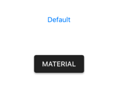

# Xamarin.Forms material visual

Xamarin.Forms has provided material design support for the framework controls in 3.6 version for iOS and Android platforms. When it is enabled in the application, all the supported views will render in a consistent look and feel.

To learn about the configurations required at the application level, please follow the detailed guidelines in this [link](https://docs.microsoft.com/en-us/xamarin/xamarin-forms/user-interface/visual/material-visual).

To achieve this, we need to set the ['Visual'](https://docs.microsoft.com/en-us/dotnet/api/xamarin.forms.visualelement.visual?view=xamarin-forms#Xamarin_Forms_VisualElement_Visual) property as ['Material'](https://docs.microsoft.com/en-us/dotnet/api/xamarin.forms.visualmarker.material?view=xamarin-forms). 


<StackLayout Spacing="50" VerticalOptions="Center" HorizontalOptions="Center">
    <Button Text="Default" />
    <Button Text="Material" Visual="Material" />
</StackLayout>


"Visual" is a property that can be set to an element or to a parent or to the page itself. As a result, you can set the ['Visual'](https://docs.microsoft.com/en-us/dotnet/api/xamarin.forms.visualelement.visual?view=xamarin-forms#Xamarin_Forms_VisualElement_Visual)property as ['Material'](https://docs.microsoft.com/en-us/dotnet/api/xamarin.forms.visualmarker.material?view=xamarin-forms) for the root element and override it as “Default” for specific element if necessary.


<StackLayout Visual="Material" Spacing="50" VerticalOptions="Center" HorizontalOptions="Center">
    <ProgressBar Progress="0.5" ProgressColor="Black" WidthRequest="200" />
    <ProgressBar Progress="0.5" ProgressColor="Black" WidthRequest="200" Visual="Default" />
</StackLayout>


## Xamarin.Forms material visual for Syncfusion controls

You do not need to make any additional modifications to use this feature with Syncfusion controls. The method is exactly the same as the one mentioned above. By simply setting the ['Visual'](https://docs.microsoft.com/en-us/dotnet/api/xamarin.forms.visualelement.visual?view=xamarin-forms#Xamarin_Forms_VisualElement_Visual) property as ['Material'](https://docs.microsoft.com/en-us/dotnet/api/xamarin.forms.visualmarker.material?view=xamarin-forms) to either Syncfusion control or any of its parent views, the UI will be updated. In Volume 3, 2019, we have provided this support for the following controls. 

* Calendar
* Button
* CheckBox
* Radio Button
* Chips
* Range Slider
* Scheduler
* Switch
* Tabbed View
* DataGrid
* Popup
* Picker
* ListView
* TreeView
* Expander
* Accordion