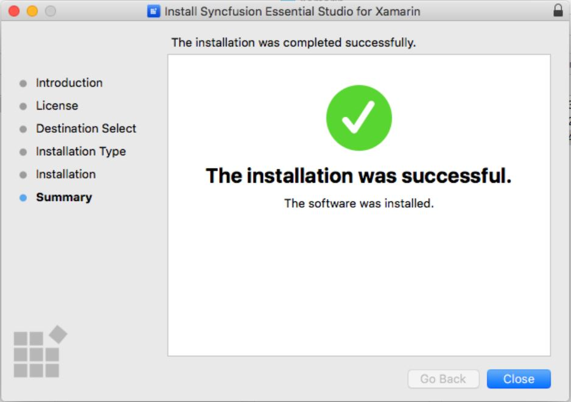
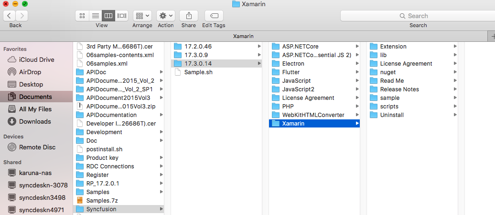

# Mac Installation

The following procedure illustrates how to install Xamarin Mac installer. 

1. Double-click the Syncfusion Xamarin Mac Installer(.pkg) file. The Installer Wizard opens. Click Continue.

   
   

2. Software License Agreement window opens. Click Continue.

      
   

3. Confirmation window will be displayed for the License Agreement. Click **Agree**.

   
   
   N> Unlock key is not required for installing the Mac installer. Syncfusion Mac installer can be used for developing purposes without registering the Unlock key.

4. Destination Select windows opens. Click Continue.

   

5. Installation Type window opens. Click Install.

   

6. Authentication window opens. Provide the password and click **Install Software**

   

7. Installation will be started in your machine. 
   
   
   
8. Completed screen will be displayed once the installation is finished. Click Close to exit the installation wizard. 

   
   
By default, Mac installer will install the files in following location.

   **Location:** {Documents}\Syncfusion\ {version}\ {platform}
   
   
   
   
### Explore the libraries package

You can find the Syncfusion libraries, samples and NuGet from the installed location in Mac.

{Essential Studio installed location}\Syncfusion\Essential Studio\{version}\Xamarin

* **"lib"** folder - e.g., /Users/labuser/Documents/Syncfusion/16.2.0.41/Xamarin/lib

   It contains all the required libraries for Xamarin.iOS, Xamarin.Android, and Xamarin.Forms projects.

* **"nuget"** folder - e.g., /Users/labuser/Documents/Syncfusion/16.2.0.41/nuget

   It contains the above libraries as NuGet packages. The same NuGet packages also can be configured from online [nuget.org](https://api.nuget.org/v3/index.json).

* **"sample"** folder - e.g., /Users/labuser/Documents/Syncfusion/16.2.0.41/sample

   It contains the sample applications for our controls in Xamarin.iOS, Xamarin.Android, and Xamarin.Forms platforms in iOS, Android, and Forms folders, respectively.

The "Forms" directory includes,

* Individual control sample folders: It contains the samples for individual controls such as SfChart, SfDataGrid, etc. Since they represent the individual controls, these samples are light-weighted. You can check the samples for your required controls alone faster with minimum deployment time.
 
* “nuget” folder: It contains the compiled assemblies of the above samples as NuGet package. It is referred in the common sample browser as explained in the next step.

* “SampleBrowser” folder: It contains common sample browser, which refers the individual control's samples as NuGet package. Run this to see the demo samples of all the controls in single application.

* It also contains showcase samples such as Patient Monitor, Server Monitor, and Invoice.

### Add reference to the project

You can then add the assembly references to the respective projects such as PCL, XForms.Droid, XForms.iOS. You can find the dependencies for each control from this [link](https://help.syncfusion.com/xamarin/introduction/control-dependencies).

I> After adding the reference, currently, an additional step is required for iOS and UWP projects. For example, if we are using SfKanban, we need to call the Init method of SfKanbanRenderer as shown in this [KB article](https://www.syncfusion.com/kb/7171).

